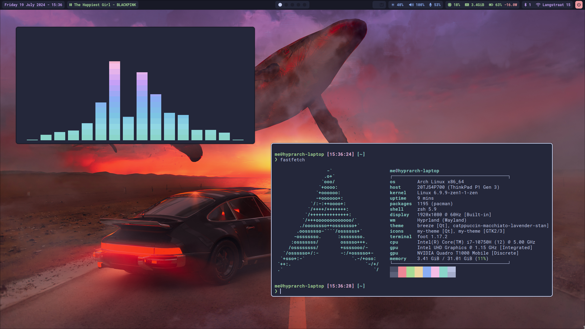
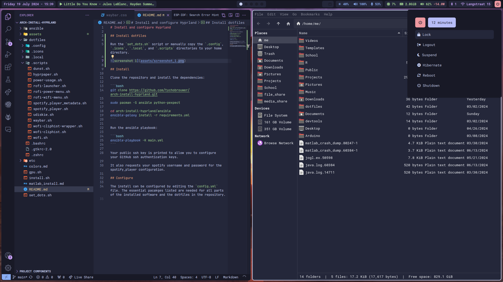
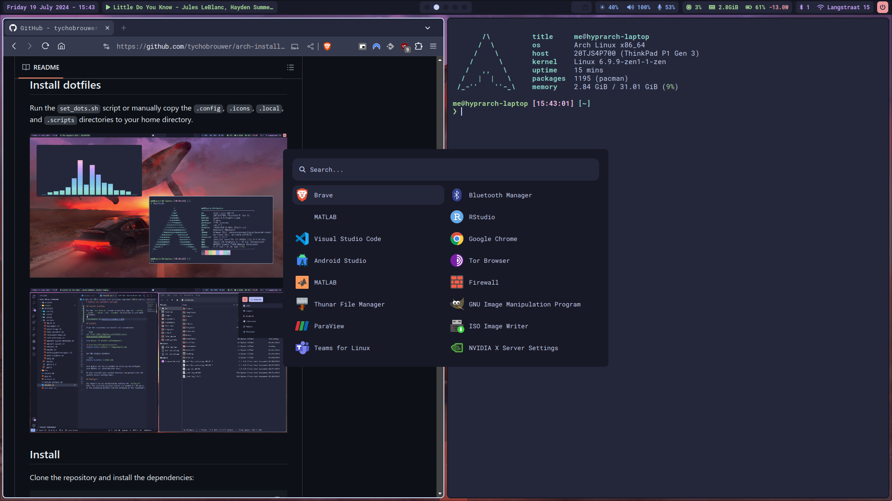

# Install and configure Hyprland

## Install dotfiles

Run the `set_dots.sh` script or manually copy the `.config`, `.icons`, `.local`, and `.scripts` directories to your home directory.







## Install Everything

Clone the repository and install the dependencies:

```bash
git clone https://github.com/tychobrouwer/arch-install-hyprland.git

cd arch-install-hyprland/ansible
ansible-galaxy install -r requirements.yml
```

Run the ansible playbook:

```bash
ansible-playbook -K main.yml
```

Your public ssh key is printed to allow you to configure your GitHub ssh authentication keys.

It also requests your spotify username and password for the spotify_player configuration.

### Configure

The install can be configured by editing the `config.yml` file. The essential pacakges listed are needed for all parts of the installed software and the dotfiles in the repository.
